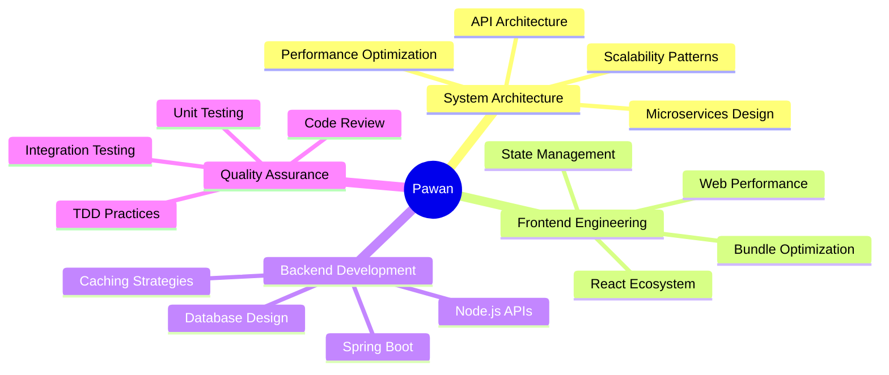

# 👨‍💻 Pawan Kumar

###  Full Stack Engineer 

  
  
  
  

---

## 🎯 About Me

<table>
<tr>
<td width="50%" valign="top">

### 📍 Currently

### 🌱 Currently Learning

### 💡 Passionate About

</td>
<td width="50%" valign="top">

### 🎯 Expertise Areas

**Frontend Excellence**

**Backend Mastery**

**Databases**

**DevOps & Tools**

### ⚡ Fun Fact

</td>
</tr>
</table>

## 💼 What I Do Best

<table>
<tr>
<td width="50%" valign="top">

### 🎨 Frontend Excellence
- ⚛️ Modern React with TypeScript
- 🎭 Advanced State Management (Redux, Context)
- ⚡ Performance Optimization & Web Vitals
- 📦 Bundle Optimization & Code Splitting
- 🎯 Component-Driven Development (Storybook)
- 🧪 Comprehensive Testing (Jest, RTL)

</td>
<td width="50%" valign="top">

### 🔧 Backend Mastery
- 🍃 Spring Boot & Java Ecosystems
- 🚀 Node.js & Express.js APIs
- 🔗 GraphQL & REST API Design
- 🗄️ Database Design & Optimization
- 🔐 Authentication & Authorization
- 📊 Microservices Architecture

</td>
</tr>
</table>

---

## 🛠️ Technology Stack

### Languages & Core

### Frontend Ecosystem

### Backend & Databases

### Testing & DevOps

---

## 📊 GitHub Statistics

---

## 🎓 Core Competencies

---

## 🏆 Achievements & Highlights

### 💡 Problem Solver | 🚀 Performance Optimizer | 🏗️ Architecture Enthusiast

<table align="center">
<tr>
<td align="center" width="33%">

### ⚡ Performance
Optimized web applications achieving 95+ Lighthouse scores

</td>
<td align="center" width="33%">

### 🏗️ Architecture
Designed scalable systems handling millions of requests

</td>
<td align="center" width="33%">

### 🧪 Quality
Maintained 80%+ code coverage with comprehensive testing

</td>
</tr>
</table>

---

## 💬 Let's Collaborate

I'm always interested in discussing:
- 🚀 Performance optimization techniques
- 🏗️ System architecture and design patterns
- ⚛️ Modern React patterns and best practices
- 🔧 Backend scalability challenges
- 📊 Technical leadership and mentoring

### 📫 Get In Touch

---

## ☕ Support My Work

If you find my open-source contributions helpful, consider supporting me!

---

### ⭐ From [carefree-ladka](https://github.com/carefree-ladka) with 💜

**"Building tomorrow's web, one optimized line of code at a time"** 🚀

