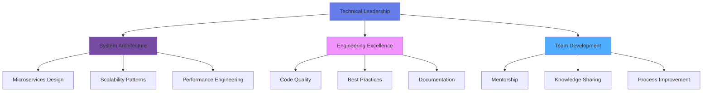
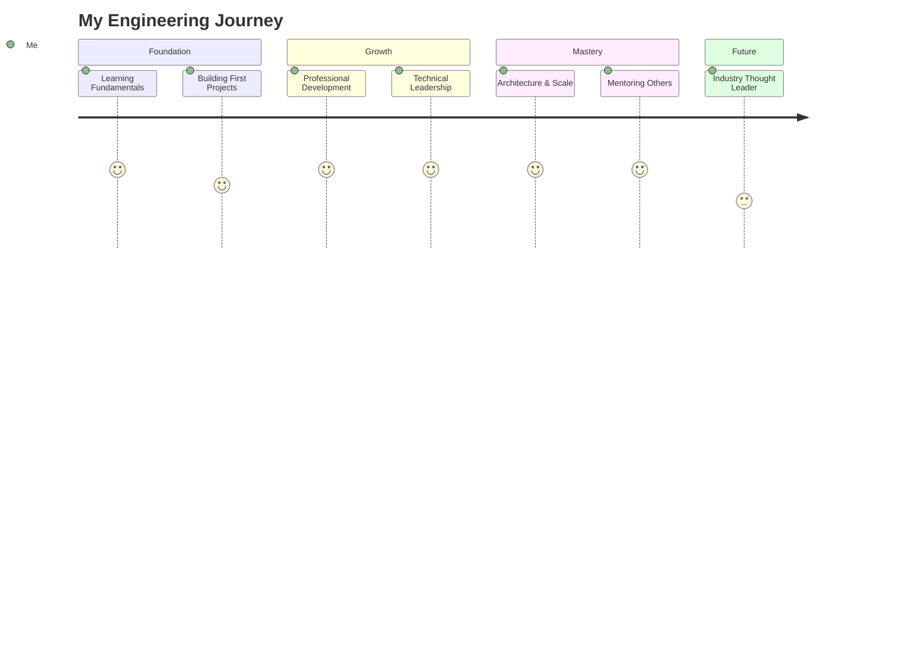

# Pawan Kumar
### Senior Full Stack Engineer | Technical Lead

---

## 👋 Introduction

I'm a senior full stack engineer with expertise in building scalable, high-performance web applications. I specialize in architecting resilient systems, leading technical initiatives, and mentoring engineering teams to deliver exceptional digital experiences.

**Current Focus:** Building distributed systems, optimizing large-scale applications, and driving engineering excellence through modern architectural patterns.

---

## 🎯 Professional Summary

**Senior Full Stack Engineer** with 5+ years of experience designing and delivering enterprise-grade applications. Proven track record of:

- 🏗️ Architecting microservices-based systems serving millions of users
- ⚡ Reducing application load times by 60% through strategic optimization
- 👥 Leading cross-functional teams and establishing engineering best practices
- 🚀 Driving technical roadmaps and delivering high-impact features

**Core Philosophy:** Write code that scales. Build systems that endure. Lead teams that thrive.

---

## 💼 Technical Leadership

### System Architecture & Design
- Microservices architecture design and implementation
- Event-driven architectures with message queues (RabbitMQ, Kafka)
- API gateway patterns and service mesh implementations
- Database sharding and replication strategies
- Caching layers (Redis, Memcached) for performance optimization

### Engineering Excellence
- Code review standards and architectural decision records (ADRs)
- CI/CD pipeline design and DevOps automation
- Performance monitoring and observability (Prometheus, Grafana, ELK)
- Technical debt management and refactoring strategies
- Documentation standards and knowledge transfer

### Team Leadership
- Mentoring junior and mid-level engineers
- Technical spike facilitation and proof-of-concept development
- Agile/Scrum technical leadership
- Cross-team collaboration and stakeholder management

---

## 🛠️ Technology Expertise

### Frontend Architecture
```
React 18+ • TypeScript • Next.js • Redux Toolkit • React Query
TanStack Router • Zustand • Webpack 5 • Vite • Turbopack
Tailwind CSS • Styled Components • MUI • Ant Design
Jest • React Testing Library • Cypress • Playwright
Storybook • Nx • Turborepo • Micro-frontends
```

### Backend Engineering
```
Spring Boot 3.x • Java 17+ • Spring Cloud • Spring Security
Node.js 20+ • Express.js • NestJS • Fastify
GraphQL (Apollo Server) • REST APIs • gRPC • WebSockets
PostgreSQL • MySQL • MongoDB • Redis
Hibernate/JPA • TypeORM • Prisma • Mongoose
```

### DevOps & Infrastructure
```
Docker • Kubernetes • AWS (EC2, S3, Lambda, RDS, CloudFront)
Jenkins • GitHub Actions • GitLab CI • ArgoCD
Terraform • Nginx • Apache • PM2
Prometheus • Grafana • ELK Stack • New Relic
```

### Software Engineering Practices
```
Clean Architecture • Domain-Driven Design • SOLID Principles
Test-Driven Development • Behavior-Driven Development
Design Patterns • Refactoring • Code Quality Tools (SonarQube)
Git Flow • Trunk-Based Development • Feature Flags
```

---

## 🏗️ Architecture Visualization



---

## 📈 Impact & Achievements

### Performance Engineering
- 🚀 **60% load time reduction** across flagship applications through bundle optimization and code splitting
- ⚡ **95+ Lighthouse scores** consistently achieved through Core Web Vitals optimization
- 📊 **40% improvement in API response times** via database query optimization and caching strategies

### Architecture & Scalability
- 🏗️ **Designed and implemented** microservices architecture supporting 5M+ monthly active users
- 🔄 **Migrated legacy monolith** to modern tech stack with zero downtime deployment
- 🌐 **Built distributed systems** with 99.9% uptime SLA compliance

### Code Quality & Testing
- 🧪 **Established testing culture** achieving 85%+ code coverage across critical services
- 📋 **Implemented automated code review** processes reducing bug escape rate by 45%
- 🔍 **Introduced static analysis tools** catching 200+ potential issues before production

### Team Leadership
- 👥 **Mentored 8+ engineers** from junior to mid-level positions
- 📚 **Created technical documentation** framework adopted org-wide
- 🎯 **Led sprint planning** and architectural discussions for 15+ person engineering team

---

## 🎓 Technical Competencies Matrix

| Domain | Technologies | Proficiency |
|--------|-------------|-------------|
| **Frontend Frameworks** | React, Next.js, TypeScript | ██████████ 95% |
| **Backend Development** | Spring Boot, Node.js, NestJS | ██████████ 90% |
| **Database Systems** | PostgreSQL, MongoDB, Redis | █████████░ 85% |
| **Cloud & DevOps** | AWS, Docker, Kubernetes, CI/CD | ████████░░ 80% |
| **System Design** | Microservices, Event-Driven, DDD | █████████░ 85% |
| **Testing & QA** | Jest, Cypress, Integration Testing | ████████░░ 80% |

---

## 💡 Areas of Interest & Continuous Learning

Currently exploring and deepening expertise in:

- 🧠 **Advanced System Design:** CQRS, Event Sourcing, Saga patterns
- 🔐 **Security Engineering:** OAuth 2.0, JWT, Zero-Trust Architecture
- 📊 **Data Engineering:** Real-time analytics, Data pipelines, ETL processes
- 🤖 **AI/ML Integration:** Embedding LLMs in production applications
- 🌐 **Edge Computing:** CDN optimization, Edge functions, serverless architectures

---

## 🤝 Collaboration & Open Source

I actively contribute to open source and enjoy collaborating on:

- **Performance Optimization:** Webpack plugins, build tools, performance monitoring utilities
- **Developer Tools:** CLI tools, VS Code extensions, debugging utilities
- **Technical Writing:** Architecture documentation, best practice guides, tutorials
- **Community Engagement:** Code reviews, mentoring, tech talks

### 📫 Let's Connect

I'm always interested in discussing:
- 🏗️ Large-scale system architecture challenges
- ⚡ Performance optimization strategies and war stories
- 🧪 Testing strategies for complex applications
- 👥 Engineering leadership and team building
- 📚 Technical mentorship and knowledge sharing

**Open to:** Technical advisory roles, architectural consulting, speaking engagements, and meaningful open-source collaborations.

---

## 📊 GitHub Analytics


---

## 🎯 Professional Philosophy

> "Great software is not just about writing code—it's about solving real problems, empowering teams, and building systems that stand the test of time. I believe in servant leadership, continuous learning, and the power of well-crafted architecture to transform businesses."

### My Approach:
- **Think in systems, not just features** – Every line of code is a long-term investment
- **Optimize for maintainability** – Code is read 10x more than it's written
- **Lead by example** – The best way to influence is through demonstrated excellence
- **Embrace failure** – Every bug is a learning opportunity, every incident improves resilience

---

## 📈 Continuous Improvement



---

### ⭐ Let's Build Something Amazing Together

I believe the best work happens at the intersection of technical excellence and collaborative spirit. If you're working on interesting problems or building the next generation of web experiences, let's connect.


---

**"Engineering excellence is a journey, not a destination. Every commit is an opportunity to improve, every PR a chance to teach, and every deployment a step toward building systems that matter."** 

— Pawan Kumar 🚀
