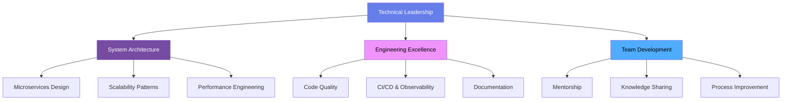

<div align="center">

# Hi, I'm Pawan 👋

### Senior Full Stack Engineer · Technical Lead


[](#)
[](#)
[](#)

</div>

---

## 📊 Snapshot

<div align="center">

| 🏗️ Scale | ⚡ Performance | 🧪 Quality | 👥 Leadership |
|:---:|:---:|:---:|:---:|
| **5M+** monthly active users | **60%** faster load times | **85%+** test coverage | **8+** engineers mentored |
| **99.9%** uptime SLA | **95+** Lighthouse score | **45%** fewer escaped bugs | **15+** person team led |

</div>

---

## 🛠️ Tech Stack

<div align="center">

**Frontend**
<br>


**Backend**
<br>


**Data**
<br>


**DevOps**
<br>


</div>

---

## 🎯 Proficiency

```
Frontend (React/Next/TS)   ████████████████████ 95%
Backend (Spring/Node/Nest) ██████████████████░░ 90%
Databases (PG/Mongo/Redis) █████████████████░░░ 85%
System Design (DDD/Events) █████████████████░░░ 85%
Cloud & DevOps (AWS/K8s)   ████████████████░░░░ 80%
Testing (Jest/Cypress)     ████████████████░░░░ 80%
```

---

## 🏗️ How I Think About Architecture



---

## 📈 GitHub Activity

<div align="center">


</div>

---

## 🔭 Currently Exploring

<div align="center">


</div>

---

<div align="center">

### 💬 Open to: architecture consulting · technical advisory · speaking · OSS collaboration


</div>
